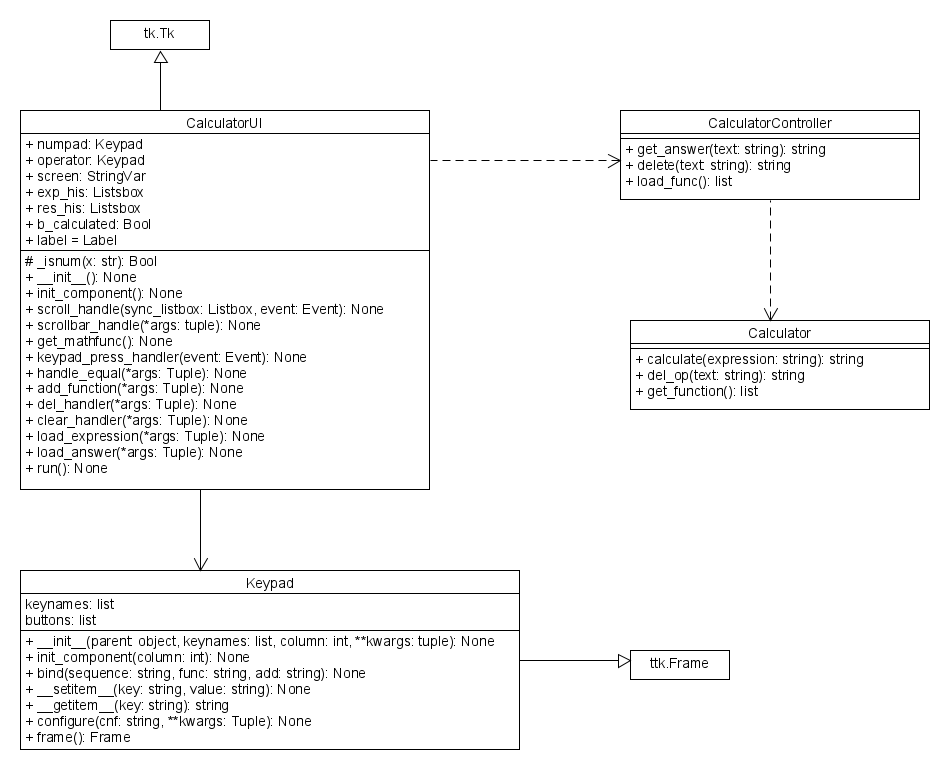

# calculator
A Basic Calculator with UI

### Including

| file name               | class name           | description                                          |
|-------------------------|----------------------|------------------------------------------------------|
| main.py                 | -                    | Main module to run the calculator                    |
| calculator.py           | Calculator           | Perform the Calculation and Operation for Calculator |
| calculatorcontroller.py | CalculatorController | Invoke the function in Calculator Class              |
| calculator_ui.py        | CalculatorUI         | Handle the UI for Calculator                         |

## Required Module
- pygame `` pip install pygame ``

## How to run

``python main.py``

### UML Diagram

